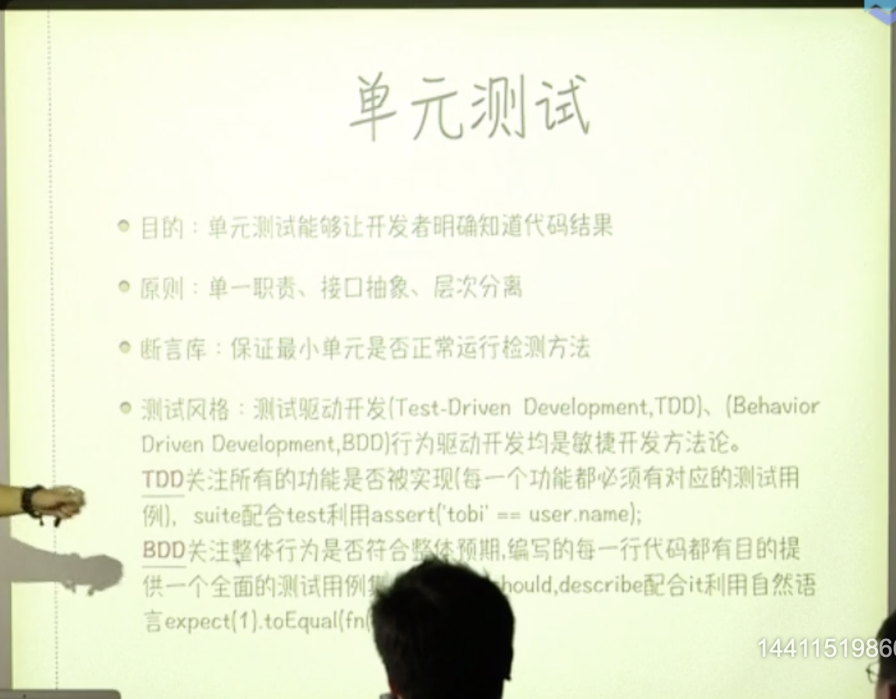

# 测试

## 单元测试

单元测试能够让开发者明确知道代码结果

单一职责
接口抽像
层次分离
断言库： 保证最小单元是否正常运行检测方法
测试分割：
 测试驱动开发TDD： 关注所有功能是否被实现 

 better-assert

 行为驱动开发BDD  关注整体行为是否符合整体预期

 should.js
 expect.jsp
Jasmine.js

chai.js

Node.js require("assert")

单元测试运行流程
每一个测试用例组都通过describe进行设置
before
beforeEach
it expect(x).to.equal(true)
异步mocha ，mock
after
afterEach

自动化单元测试

karma 自动化runner集成 PhantomJS无刷新

npm install karma-cli -save-dev

npm  install  karma-chrome-lanucher --save-dev

npm  install karma-phantomjs-launcher --save-dev

npm install karma-mocha --save-dev

npm insgall karma-chai

报告和单元测试覆盖率检查

npm 　 install karma-coverage --save-defineReactive

coverageReport(type: "html", dir: 'coverage/')

## 性能测试

基准测试

面向切面编程AOP无侵入式统计

Benchmark基准测试方法，他并不是简单的统计执行多少次测试代码对比时间，他对测试有着严格的抽样过程，执行多少次取决于采样到的数据能否完成统计，根据统计次数计算方差。

压力测试

PV网站当日访问人数
UV独立访问人数

QPS = PV/t；

ab 　-c 100 -n 100 http://localhost:8010

## 安全测试

XSS  
SQL
CSRF

## 功能测试

selenium-webdirver
protractor selenium-standalone
http://webdirver.io/post
冒烟测试 SmokeTest
回归测试

jsLint JsHint

